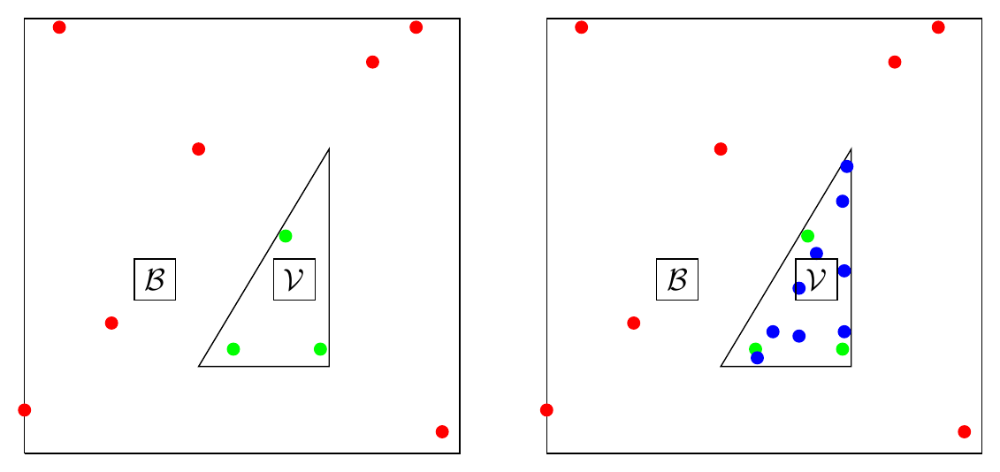

# Machine Learning for Dynamic Incentive Problems



## Description of programs and datasets used

### Organization of the repository

This Python-based code repository contains the replication package for the paper *[Machine Learning for Dynamic Incentive Problems](#citation)* by [Philipp Renner](https://sites.google.com/site/phrenner/) and [Simon Scheidegger](https://sischei.github.io/).

The repository contains two main folders:

1. [`dptorch/`](dptorch/): The general-purpose solver and all model implementations. It combines dynamic programming with Gaussian Process regression to approximate value and policy functions in high-dimensional models. Each economic model lives in its own subfolder (see the [model overview](#model-overview-and-approximate-runtimes) below).
2. [`figure_replication/`](figure_replication/): Scripts, Jupyter notebooks, and pre-computed checkpoints used to reproduce all figures and tables in the paper. Replication can be done either from the bundled checkpoints (no cluster needed, approximately 15 minutes) or by re-running the full solver from scratch (approximately one week on a cluster, subject to hardware availability). See the sequential [instructions for the replicator](#replication) below.

#### The solver: `dptorch/`

* `run_dpgp.py`: main entry point for solving a model.
* `post_process.py`: generic post-processing entry point.
* `post_process_2DFP.py`: extended post-processing for the `2D_Fernandes_Phelan` model.
* `DPGPModel.py`: base class for GP-based dynamic programming.
* `DPGPScipyModel.py`: SciPy-based constrained solver backend.
* `DPGPIpoptModel.py`: Ipopt-based constrained solver backend (optional; all results in the paper use the SciPy backend).
* `mpi_dist.py`: compatibility layer that selects the distributed backend.
* `mpi4py_dist.py`: MPI backend based on `mpi4py`.
* `torch_dist.py`: fallback backend based on `torch.distributed` with MPI support.
* `config/config.yaml`: top-level run configuration; `config/postprocess.yaml`: post-processing configuration.
* `post_processing_commands.txt`: post-processing commands used by the Step 4 Bellman-equation validation workflow.
* `runs/`: solver checkpoints and Hydra run metadata (created at runtime).
* `postprocess/`: post-processing output (created at runtime).

Each model subfolder contains:

* `Model.py`: defines `SpecifiedModel`, the economic model and solver logic.
* `Params.py`: defines `dynamic_params(cfg)`, model-specific parameters and training controls.
* `GPModel.py`: defines the Gaussian Process kernel and likelihood for that model.
* `PostProcess.py`: post-processing and error diagnostics.

#### Model overview and approximate runtimes

The seven models, the paper section they belong to, the number of value function iterations used for the results in the paper, the post-processing script to use, and approximate solver runtimes are:

| `MODEL_NAME` | Paper section | Iterations | Post-processing script | Approximate runtime |
| ---------- | ------------- | ---------- | ---------------------- | ------------------- |
| `2D_Fernandes_Phelan` | Section 4.5.1 | 2999 | `post_process_2DFP.py` | 11h 26min |
| `2D_Fernandes_Phelan_feas_set` | Section 4.5.1 | 314 | `post_process.py` | 51 min |
| `2D_baseline_to_limited_or` | Section 5.1 | 5939 | `post_process.py` | 46h |
| `2D_limited_overreporting` | Section 5.1 | 4379 | `post_process.py` | 46h |
| `4D_baseline_to_limited_or` | Section 5.2 | 3777 | `post_process.py` | 69h |
| `4D_limited_overreporting` | Section 5.2 | 2999 | `post_process.py` | 69h |
| `10D_Fernandes_Phelan` | Section 4.5.2 | 4319 | `post_process.py` | 115h |

Runtimes are for a single node with 64 MPI processes on an Intel Ice Lake or Emerald Rapids processor with 128 GB RAM. Both the iteration counts and the runtimes reflect the specific hardware available to us; on other systems these numbers may vary slightly.

On hardware comparable to a modern laptop, the baseline `2D_Fernandes_Phelan` model takes approximately 17 hours to run (benchmarked on Nuvolos.com using 16 virtual cores, 64 GB RAM, and an AMD EPYC 9354P processor).

#### Figure and table replication: `figure_replication/`

The four top-level replication scripts automate the available workflows:

* `2_replicate_original.sh`: regenerates the paper figures and tables from the deposited data (\~15 minutes).
* `3_replicate_fp.sh`: solves the baseline `2D_Fernandes_Phelan` model from scratch and recreates its outputs (\~17 hours with 16 processes).
* `4_validate_BE.sh`: restarts the five remaining deposited models to validate their Bellman equations (\~1 hour with 16 processes).
* `5_run_all_models.sh`: performs the six full model solves and generates all associated outputs (cluster-scale run).

The contents of the three subfolders:

* `Sec_3/`: standalone Python scripts for the analytical examples in Section 3:
    * `analytical_example_1d.py`: produces Figure 1 (\~1 minute).
    * `analytical_example_2d.py`: produces Figure 2 (\~5 minutes, requires Tasmanian).
* `Sec_4_5_Fernandes_Phelan/`: notebooks for the Fernandes-Phelan model (Sections 4 and 5). Pre-computed checkpoints and intermediate results are in `data/2D/`, `data/10D/`, and `data/feas_set/`:
    * `2D_run_simulation.ipynb`: reruns the simulation for Section 4.5.1. Output is written to `data/2D/`.
    * `Plots_Table_2D_fernandes_phelan.ipynb`: produces Figures 4 and 5, and Table 2. Also prints the numerical value function maximum cited in the text of Section 4.5.1. To fully replicate the error plot, the value function iteration must be re-run from scratch (Step 3) and the files in `data/2D/` replaced.
    * `Table_10D_fernandes_phelan.ipynb`: produces Tables 4 and 5 for Section 4.5.2. Also prints additional GP diagnostics cited in the text.
* `Sec_5_overreporting/`: notebooks for the limited-overreporting model (Section 5). Pre-computed checkpoints and intermediate results are in `data/2D/` and `data/4D/`, each with `baseline/` and `overreporting/` subfolders:
    * `2D_simulation_and_error.ipynb`: reruns simulation and value function error computation for Section 5.1. Output is written to `data/2D/baseline/` and `data/2D/overreporting/`.
    * `4D_simulation_and_error.ipynb`: reruns simulation and value function error computation for Section 5.2. Output is written to `data/4D/baseline/` and `data/4D/overreporting/`.
    * `Plot_Table_2D_overreporting.ipynb`: produces Figure 6 and Table 7. Also prints additional GP diagnostics cited in the text.
    * `Plot_Table_4D_overreporting.ipynb`: produces Figure 7 and Table 8. Also prints additional GP diagnostics cited in the text.

### Replication of the numerical results

The sequential replication workflows are described in [Replication](#replication).

### Datasets used

All data used in this paper are generated by the code in this repository. There are no external datasets to download.

### Statement about Rights

We certify that the authors of the manuscript have legitimate access to and permission to use all material in this package.

### Summary of Availability

The simulations, figures, and tables can be reproduced from the provided source code and pre-computed checkpoints.

## Computational requirements

### Software requirements

* We provide implementations using <strong>Python 3.9.23</strong>.
* The file `requirements.txt` lists all pinned dependencies. Install with:

    ```bash
    conda create --name rep python=3.9.23
    conda activate rep
    conda install cmake
    pip install -r requirements.txt
    ```

    See [here](https://pip.pypa.io/en/stable/user_guide/#ensuring-repeatability) for further instructions on creating and using `requirements.txt` files.
* The core dependencies are:

    | Package | Version | Purpose |
    | ------- | ------- | ------- |
    | `torch` | 2.4.0 | Tensor backend and neural network infrastructure |
    | `gpytorch` | 1.13 | Gaussian Process models |
    | `linear-operator` | 0.5.3 | Linear algebra backend of `gpytorch` |
    | `scipy` | 1.13.1 | Constrained optimization (SciPy backend) |
    | `hydra-core` | 1.3.2 | Configuration management |
    | `mpi4py` | 4.1.2 | Distributed MPI execution (cluster runs) |
    | `matplotlib` | 3.9.4 | Plotting |
    | `jupyter` / `jupyterlab` | 1.1.1 / 4.5.7 | Notebook execution |
    | `Tasmanian` | 8.2 | Sparse grids (Figure 2 only) |

    <strong>Note on `linear-operator`:</strong> the pinned version 0.5.3 must not be substituted with a newer release. The `linear-operator` 0.6.x series requires Python ≥ 3.10 and is therefore incompatible with the Python 3.9.23 environment used here; installing it can also silently change numerical results in the Gaussian Process fits.
* **System utilities** (not Python packages; install via your OS package manager):
    * `GNU parallel` (version 20231122), used by `4_validate_BE.sh` for parallel post-processing. Install via:

        ```bash
        sudo apt-get install parallel   # Ubuntu/Debian
        brew install parallel           # macOS
        ```
* **Additional dependency for Figure 2:** `Tasmanian` (the ORNL sparse grids library) is required by `figure_replication/Sec_3/analytical_example_2d.py`. It is pinned in `requirements.txt` (`Tasmanian==8.2`), so `pip install -r requirements.txt` normally installs it automatically. If you need to install it on its own, use one of the following (in order of preference; see the [official installation guide](https://ornl.github.io/TASMANIAN/rolling/) for full details):

    ```bash
    # 1. pip (recommended for Python users; ensure pip is up to date first)
    python3 -m pip install --upgrade pip
    python3 -m pip install Tasmanian==8.2
    
    # 2. Spack (common in HPC environments)
    spack install tasmanian@8.2
    ```

    Alternatively, build from source via CMake following the instructions at [https://ornl.github.io/TASMANIAN/rolling/](https://ornl.github.io/TASMANIAN/rolling/). After installation, verify that the Python module is importable:

    ```bash
    python3 -c "import Tasmanian; print(Tasmanian.__version__)"
    ```
* **MPI:** `mpi4py` is the preferred distributed execution backend; if it is installed, `dptorch/mpi_dist.py` selects it automatically. A custom PyTorch build with MPI-enabled `torch.distributed` is also supported (`dptorch/torch_dist.py`) for compatibility with older cluster environments.
* **Mathematica 14.1** was used to precompute autarky states (see `dptorch/*/autarky_state_precompute.nb`). Mathematica is **not** required to replicate any figure or table in the paper; these notebooks are included as reference material only.
* All materials were developed and validated on Linux. Replication on Windows or macOS may require minor adjustments to shell scripts and MPI launches.

### Docker image

The exact image used for this package is:

```bash
nuvolos/public@sha256:087f6ad182fc08ca19ee6030e659021ab2ee3e8117e0dd64f351267848aec220
```

Pull it by digest:

```bash
docker pull nuvolos/public@sha256:087f6ad182fc08ca19ee6030e659021ab2ee3e8117e0dd64f351267848aec220
```

The Docker image is **not required** to replicate the paper: Steps 1-5 below run directly on a Linux host in the conda environment created by `1_install.sh`. The image is provided as a long-term archive of the exact software environment used by the authors, so that the results can still be re-run if package versions become unavailable in the future.

Everything related to the image is collected in the [`reproducibility/`](reproducibility/) folder. Its [`README.md`](reproducibility/README.md) gives step-by-step instructions for running the replication inside the container, and explains the files in that folder:

* the image metadata (digest, layer hashes, runtime configuration),
* a software bill of materials listing every package installed in the image, and
* a reconstructed Dockerfile that documents how the image was built.

Note that the reconstructed Dockerfile is documentation only. Some files used in the original build are not available, so rebuilding from it will not produce a byte-identical image. The pinned digest above is the authoritative reference for the environment; do not substitute a rebuilt image for it.

### Controlled randomness

The random seed for all model runs is set in `dptorch/config/config.yaml` at the field `seed: 0`. For the figure replication from checkpoints, the exogenous shock sequences are stored as fixed files (`*_shock_lst.txt`) in each `figure_replication/*/data/` subfolder, ensuring exact reproducibility of simulation outputs without re-running the full solver.

### Memory and runtime requirements

* **Full model solve (Steps 3 and 5):** All solver runs were performed on a single compute node with 64 MPI processes on an Intel Ice Lake or Emerald Rapids processor (cluster auto-assigns) with 128 GB RAM. Cluster submission scripts (`dptorch/submit.sh`, `dptorch/submit_slurm.sh`) are included as reference for SLURM environments.
<br>
    Steps 1-4 can be run on the Nuvolos instance used for the replication. Step 5 is the only step that requires cluster-scale allocations in practice. The six full model solves in Step 5 take approximately 346 hours sequentially at 64 MPI processes (0.85 + 46 + 46 + 69 + 69 + 115 hours). The baseline `2D_Fernandes_Phelan` model takes approximately 17 hours at 16 processes on Nuvolos, compared with 11 hours 26 minutes at 64 processes on the reference cluster. Thus, running all of Step 5 on a 16-process Nuvolos instance would take roughly three weeks in the optimistic case, and potentially up to two months if the larger models scale less well. MPI rank counts also affect work partitioning and random draws, so a 16-process run is statistically equivalent but not bit-identical to the reference run.
* **Post-processing and figure replication (Steps 2-5):** All post-processing and notebook execution was performed on a desktop with an AMD Ryzen 9 5950X 16-core processor running Ubuntu 24.04.4 LTS.
* **Accuracy evidence:** The numerical accuracy diagnostics and validation discussion are reported in Section 4.3 of the paper. Step 4 and the supplemental error tables it produces provide reproducible checks using the deposited checkpoints; they should be read together with that section rather than as a replacement for it.
* **Total time to reproduce all results:**
    * *From the pre-computed checkpoints (Step 2 only):* about 15 minutes on a standard desktop.
    * *From scratch (all steps, including the full solver):* approximately one week when models are run concurrently on separate cluster nodes (individual model runtimes range from 51 minutes to 115 hours; see the [model overview](#model-overview-and-approximate-runtimes)).

## Replication

Step 1 is a one-time installation. Steps 2-5 are alternative replication workflows, each implemented by one top-level script. Their generated PDFs and LaTeX tables are collected under `figure_replication/figure_and_table_outputs/<step>/`. The paper's tables and figures are included in `figure_replication/figure_and_table_paper/`.

| Script no. | Replication pattern | Expected runtime | What this shows | What it does not establish |
| ---------- | ------------------- | ---------------- | --------------- | -------------------------- |
| 2 | Basic paper replication | \~15 minutes | The deposited value functions and simulations generate the figures and tables in the manuscript. | It does not rerun the solver or test convergence. |
| 3 | End-to-end baseline solver check | \~17 hours on Nuvolos with 16 processes | The solver can reproduce the classical 2D Fernandes-Phelan model from scratch. | It does not rerun the other five full models. |
| 4 | Checkpoint and Bellman verification | \~1 hour on Nuvolos with 16 processes | Five deposited solutions can be restarted and tested with fixed-shock simulations and Bellman-equation diagnostics. | It does not re-solve every problem from scratch. |
| 5 | Full cluster replication | \~346 hours sequentially at 64 MPI processes; about one week when models run concurrently on separate cluster nodes | All six additional full model solves are rerun. | It is not practical on a typical laptop or Nuvolos instance at 16 processes. |

### Step 1: Set up the software environment

This step sets up the conda environment rep needed to execute the other replication steps.

```bash
chmod u+x 1_install.sh
./1_install.sh
```

### Step 2: Replicate the deposited paper outputs

* **Note: If you ran either steps 3 or 5 beforehand, then the stored results were overwritten and need to be restored from the original archive.**

This workflow uses the deposited checkpoints and intermediate files to generate every available paper figure and table. It does not run simulations or solvers.

```bash
chmod u+x 2_replicate_original.sh
./2_replicate_original.sh
```

### Step 3: Reproduce the baseline Fernandes-Phelan model

This workflow solves `2D_Fernandes_Phelan` from scratch, post-processes its final checkpoint, generates Figures 4 and 5 and Table 2, and saves those outputs in `figure_and_table_outputs/3/`. Set `N_PROCS` in the script to the number of available MPI processes. The reference configuration uses 16 processes; the solver's random draws depend on that count.

```bash
chmod u+x 3_replicate_fp.sh
./3_replicate_fp.sh
```

### Step 4: Validate the Bellman equation

This workflow restarts the five deposited final checkpoints, other than the baseline 2D Fernandes-Phelan model, for ten iterations, runs post-processing, simulations, and diagnostics, then generates the associated figures and tables in `figure_and_table_outputs/4/`. Adjust `N_RESTARTS`, `N_ITS`, and `N_PROCS` at the top of the script if needed.

```bash
chmod u+x 4_validate_BE.sh
./4_validate_BE.sh
```

### Step 5: Full cluster replication

* **Warning: This step requires a cluster to execute in a reasonable amount of time.**

This workflow re-solves the six non-baseline models from scratch, post-processes them, reruns the simulations and all plotting notebooks, and collects the output in `figure_and_table_outputs/5/`. It requires the baseline model outputs created by Step 3. Run Step 3 first, then use a cluster-scale allocation and adjust `N_PROCS` if necessary.

```bash
chmod u+x 5_run_all_models.sh
./5_run_all_models.sh
```

Each workflow replaces existing generated plotting files before collecting its outputs. Step 2 can be rerun to regenerate the deposited paper exhibits after a validation or solver run.

### Output map: every figure and table to its producing script

| Paper output | Producing script / notebook |
| ------------ | --------------------------- |
| Figure 1 | `figure_replication/Sec_3/analytical_example_1d.py` |
| Figure 2 | `figure_replication/Sec_3/analytical_example_2d.py` |
| Figures 4 & 5, Table 2 | `figure_replication/Sec_4_5_Fernandes_Phelan/Plots_Table_2D_fernandes_phelan.ipynb` |
| Tables 4 & 5 | `figure_replication/Sec_4_5_Fernandes_Phelan/Table_10D_fernandes_phelan.ipynb` |
| Figure 6, Table 7 | `figure_replication/Sec_5_overreporting/Plot_Table_2D_overreporting.ipynb` |
| Figure 7, Table 8 | `figure_replication/Sec_5_overreporting/Plot_Table_4D_overreporting.ipynb` |
| In-text numerical results | Printed to notebook stdout during execution |

Note that Figure 3 is a schematic diagram typeset directly in the paper (LaTeX/TikZ) and therefore not generated by this package. Similarly, Tables 1, 3, 6, and 9 contain no numerical results and are therefore typeset manually.

## Authors

* [Philipp Renner](https://sites.google.com/site/phrenner/) (Lancaster University, Department of Economics)
* [Simon Scheidegger](https://sischei.github.io/) (University of Lausanne, Department of Economics)

## Citation

Please cite the paper if this code is useful for your work:

```bibtex
@article{rennerscheidegger_2026,
  title={Machine learning for dynamic incentive problems},
  author={Renner, Philipp and Scheidegger, Simon},
  year={2026},
  url = {https://ssrn.com/abstract=3282487},
  journal={Review of Economic Studies}
}
```

## Support

This work was supported by grants from the [Swiss National Supercomputing Centre (CSCS)](https://www.cscs.ch), the [Swiss Platform for Advanced Scientific Computing (PASC)](https://www.pasc-ch.org), the [Swiss National Science Foundation (SNSF)](https://www.snf.ch), and the [Enterprise for Society (E4S)](https://e4s.center). We were also supported by the High End Computing (HEC) Cluster at Lancaster University with computation time.